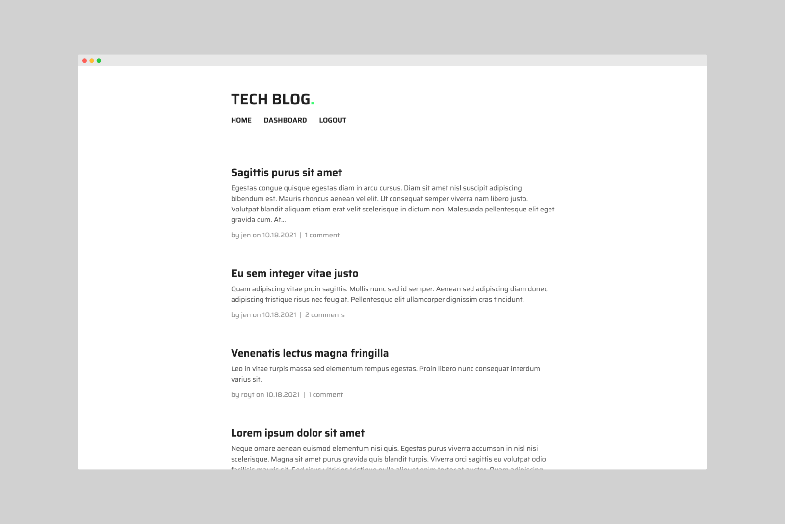

# Tech Blog

## Description
The Tech Blog is a CMS-style blog where users can publish and comment on blog posts. Users will need to sign up to be able to leave comments. When users are signed in, they can also access their dashboards where they can view, edit, or delete their previous posts. After a period of inactivity, logged-in users will be logged out and they will need to sign in again to access the blog's full functionality.

This site is deployed on Heroku and uses [Handlebars.js](https://handlebarsjs.com) as its templating language, [Sequelize](https://sequelize.org) as its ORM, and the [express-session](https://www.npmjs.com/package/express-session) npm package for authentication.

[https://agile-gorge-47704.herokuapp.com](https://agile-gorge-47704.herokuapp.com)

